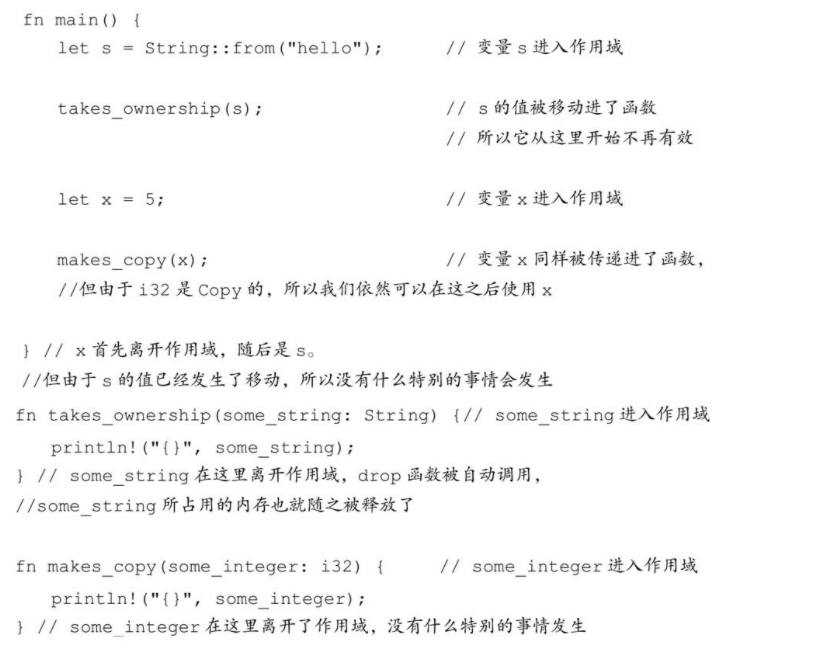
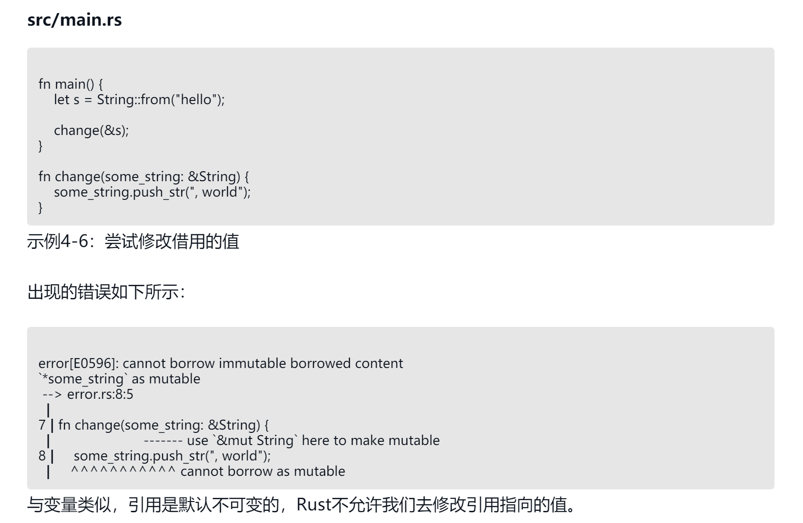

### rust变量

> rust 默认变量是不可变的，如让变量可变加上mut关键词

```rust

let x = 12 
x = 13 // compile error , x is a immutable

let mut x = 12
x = 13  // compile success


```

> rust 规则
审视上面的代码，有一个很适合用来回收内存给操作系统的地方：变量s离开作用域的地方。Rust在变量离开作用域时，会调用一个叫作drop的特殊函数。String类型的作者可以在这个函数中编写释放内存的代码。记住，Rust会在作用域结束的地方（即}处）自动调用drop函数。
```rust
{
    let s =  String::from("test");
}
```

> 所有权变化



>可变引用

